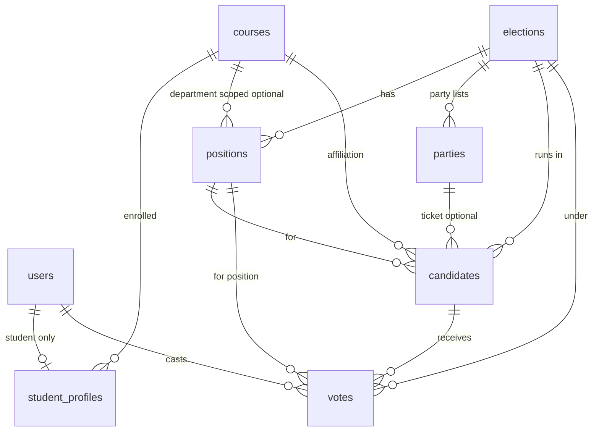

# College election database (3NF) — one database per school (no `school_id`)

## Design goals

- **Separate database per school**: Tenant isolation is **physical**—each school has its **own** MySQL (or other) database. The schema is **identical** per deployment; **do not** add `school_id` (nothing in that DB refers to “which school” because the whole DB is that school).
- **Sell to many schools**: For each new client you **provision a new database**, run migrations, and point that deployment’s **`.env`** at `DB_DATABASE` (or equivalent). Same codebase, many installs—or one install that **switches DB connection** per hostname/subdomain if you build that layer (registry of DB names lives **outside** this schema, e.g. config server or env template).
- **Customizable per deployment**: Programs (`courses`), officer titles (`positions`), elections, parties—all **data in that DB**; another school’s DB has different rows, not different `school_id` filters.
- **One login model**: [`users`](database/migrations/0001_01_01_000000_create_users_table.php) as usual; roles `admin` \| `student`.
- **Campus vs department**: **`positions.course_id`** nullable (NULL = campus-wide; non-null = department/program).
- **Party lists**: **`parties`** per election; **`candidates.party_id`** optional.

## Multi-tenancy: separate DB (not shared schema + `school_id`)

| Approach | Notes |
|----------|--------|
| **One Laravel deployment per school** | Simplest: each `.env` has its own `DB_*`. No runtime tenant resolution in app code for data queries. |
| **One codebase, many databases** | Resolve tenant from subdomain → database name/connection; Laravel **dynamic database connections**; still **no `school_id`** in tables; only the connection changes. |

Cross-school reporting or billing is **outside** this database (separate product DB or exports)—not required for the election schema.

## Optional: institution metadata in the same DB

Because there is no `schools` tenant table, local branding can use either:

- **Environment/config only** (`APP_NAME`, custom logo path in env), or  
- **Optional singleton table** `institution_settings` (`id` fixed 1 or single row): `name`, `logo_path`, `timezone`, etc.—**not** a foreign-key parent for other tables; avoids scattering institution name in env only.

No `school_id` FKs anywhere.

## Party lists (customizable per election)

| Table | Purpose |
|--------|---------|
| **`parties`** | `election_id`, `name`, optional `short_name` / `abbreviation`, `sort_order`, optional `logo_path`. Unique per election on name (or short_name rules). |
| **`candidates`** | Nullable **`party_id`** FK → `parties`; independent runners use `party_id` null. |

**Rules (application):** Party’s `election_id` must match the candidate’s election (validate in app).

## Entity-relationship (conceptual)

## Scoping positions (campus vs department)

- **`positions.course_id`** nullable FK → **`courses`**.
- **NULL** → campus-wide (within this database’s institution).
- **Non-null** → department ballot for that program.

## Tables (3NF rationale) — single-tenant DB

| Table | Purpose | Normalization note |
|--------|---------|-------------------|
| **users** | Laravel auth | Role `admin` \| `student`. **`email` unique** within this DB (Fortify-friendly). |
| **courses** | Programs / departments: `code`, `name`, optional `sort_order` | **Unique** `code` and/or `name` per deployment policy. |
| **student_profiles** | `user_id` (unique), `student_id` (unique in DB), `course_id`, optional `section`, `year_level` | **`student_id`** unique globally within this database (no composite with school). |
| **elections** | `title`, `opens_at`, `closes_at`, optional `status`, description | No `school_id`. |
| **positions** | `election_id`, `name`, `sort_order`, optional `max_selections`, **`course_id` nullable** | |
| **parties** | `election_id`, `name`, … | |
| **candidates** | `election_id`, `position_id`, `full_name`, `platform`, optional `course_id`, optional **`party_id`**, optional photo | |
| **votes** | `election_id`, `position_id`, `user_id`, `candidate_id`, timestamps | Unique `(user_id, position_id, election_id)`. |

**Imports**: **`student_import_batches`**: `admin_user_id`, `filename`, `row_count`, `created_at` — no `school_id`.

## Uniqueness and login

| Field | Rule |
|--------|------|
| **Email** | **Unique** in this database (standard Laravel). |
| **Student ID** | **Unique** in this database. |

Same person at two different schools = two different databases = no conflict.

## Voting eligibility (same logic, one institution per DB)

| Position type | Who votes |
|----------------|-----------|
| Campus-wide | Eligible students in this election (all programs). |
| Department | Students whose **`student_profiles.course_id`** matches **`positions.course_id`**. |

## Laravel alignment

- **No** tenant global scopes on `school_id`; isolation is **connection/database**.
- If using **dynamic connections**, middleware chooses `config('database.connections.mysql.database')` (or a named connection) before queries—still no `school_id` columns.
- Models: `Course`, `StudentProfile`, `Election`, `Position`, `Party`, `Candidate`, `Vote`; optional `InstitutionSetting`.

## Optional refinements

- **Position templates** stored in same DB for reuse across elections within that school.
- **Multi-campus** within one school (same DB): add `campuses` + optional `courses.campus_id` / election scoping if one institution runs split campuses.
